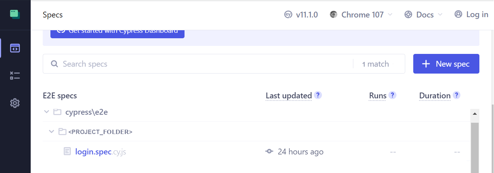
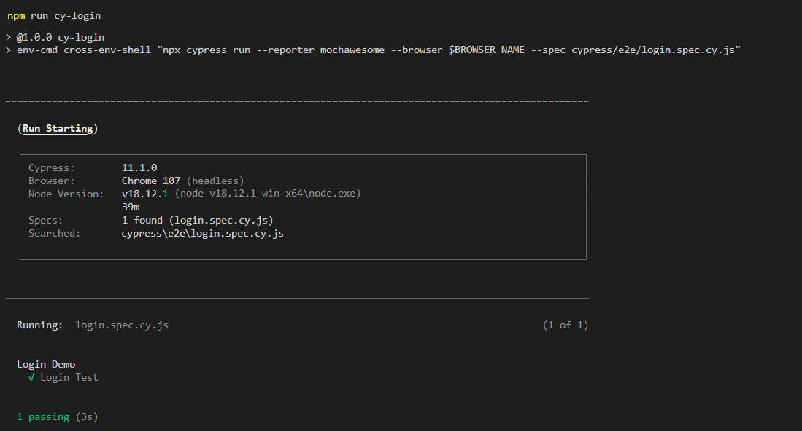

# Cypress Sample Project

[](https://www.cypress.io/)
[](https://github.com/GhsVilela/cypress-sample-project/actions/workflows/main.yml)

## Contents

- Local Setup
  - [Installation](#installation)
  - [Create env](#create-env)
    - [Variables explained](#variables-explained)
      - [Optional Variables](#optional-variables)
  - [Run tests locally](#run-tests-locally)
    - [Cypress GUI Headead](#cypress-gui-headead)
    - [NPM Scripts Headless](#npm-scripts-headless)
- Github Setup
  - [Pipeline Workflow](#pipeline-workflow)
  - [Environment Variables](#environment-variables)
    - [Environment Optional Variables](#environment-optional-variables)
  - [Run tests on Github](#run-tests-on-github)
    - [Run Pipeline](#run-pipeline)
    - [Run Scheduler](#run-scheduler)

## Local Setup

### Installation

```
npm install
```

### Create env

Before running the tests locally, it requires to have a .env created, this file can be personalized for each person using the project, this file is not pushed to project repository, its on gitignore.

**.env**
```
BROWSER_NAME=chrome
BASE_WEB_URL=https://www.saucedemo.com
LOGIN_PASSWORD=
```

More information about how .env works together with Cypress, check out the following docs:

https://nodejs.org/dist/latest-v8.x/docs/api/processhtml#process_process_env  \
https://docs.cypress.io/api/cypress-api/env#Syntax \
https://www.npmjs.com/package/dotenv \
https://www.npmjs.com/package/cypress-dotenv

#### Variables explained

> **BASE_WEB_URL** (The environment URL used for the tests, this project is testing at this sample website from Sauce Labs **https://www.saucedemo.com**)

> **BROWSER_NAME** (Usually **chrome** but can be firefox, edge or electron)

> **LOGIN_PASSWORD** (Password for the users used for the automation, this can be found at https://www.saucedemo.com home page (On real world scenario, only the project owners must have access to this value and this value must be stored only on github secrets variable)

##### Optional variables

TODO

### Run tests locally

#### Cypress GUI Headead

Cypress can be executed using its UI, for that, just use the bellow command, a window will be opened, choose the testing type, next, choose the desired browser and click on a spec file to start test execution.

```
npx cypress open
```

<p align="center">
  
</p>

#### NPM Scripts Headless

There is also NPM scripts created to easily trigger cypress execution through command line, take a look at [package.json](https://github.com/GhsVilela/cypress-sample-project/blob/main/package.json) to see all available scripts.

```
npm run <NPM_SCRIPT>
```

For example, executing only login spec:

<p align="center">
  
</p>

More information about running cypress can be found at official documentation
https://docs.cypress.io/guides/guides/command-line

## Github Setup

### Pipeline Workflow

TODO

### Environment Variables

Github uses the same variables as [local](#create-env) execution plus a few extra more to personalize pipeline workflow and docker image, it is just like executing locally, the main difference is that .env is created automatically at install job based on all varibles at Project Settings > Environments > Environment secrets.

TODO

#### Environment Optional Variables

TODO

### Run tests on github

TODO

#### Run Pipeline

TODO

#### Run Scheduler

TODO
